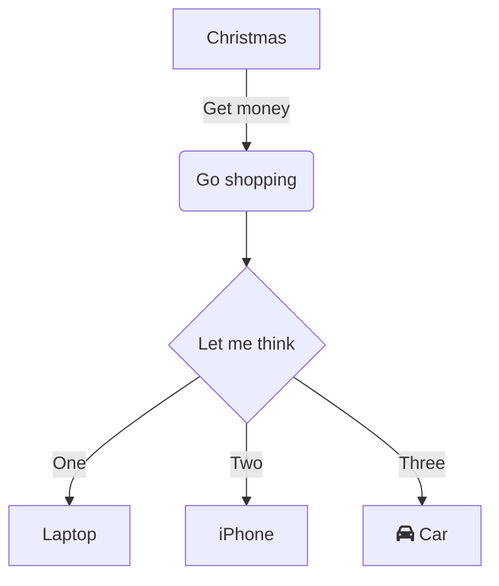

+++
date = '2025-10-17T16:22:19+08:00'
draft = true
mermaid = true
comments = true
math = true
tags = ["Hugo", "Mermaid", "KaTeX", "Giscus", "PaperMod"]
categories = ["博客搭建"]
title = '博客备忘录'
author = "mengw"
+++

- [x]：自定义字体
- [x]：添加评论系统 - Giscus
- [x]：双栏浮动布局
- [x]：LaTeX 数学公式支持
- [x]：Mermaid 作图支持


这篇文章主要用来记录博客系统在使用过程中的一些必要记录的东西。

- 核心框架：[hugo](https://gohugo.io/)
- 主题：[PaperMod](https://github.com/adityatelange/hugo-PaperMod)


## 功能测试

### LaTex 测试

行内公式：$E = mc^2$

块级公式：
$$
\int_a^b f(x)\,dx = F(b) - F(a)
$$

### Mermaid 测试




## 博客框架

一个标准的 Hugo 项目包含以下目录：

```bash
my-blog/
|—— archetypes/   # 用于新内容的模板
|—— assets/       # 全局资源
|—— contents/     # 组成站点内容的md文件和页面资源
|—— data/         # 用于增强内容、配置、本地化和导航的数据文件
|—— i18n/         # 多语言站点的翻译表
|—— layouts/      # 自定义页面布局
|—— public/       # Hugo 构建输出的静态文件（部署用）
|—— resource/     #
|—— statics/      # 存放静态资源（图片、favicon、CSS）
|—— themes/       # 主题目录
|—— hugo.toml     # 站点配置文件
```

- [Hugo 项目骨架详释](https://hugo.opendocs.io/getting-started/directory-structure/#%e7%9b%ae%e5%bd%95)


## 常用命令

```bash

# 生成一篇新文章
hugo new posts/标题.md

# 启动 Hugo 的开发服务器以查看网站
hugo server -D

# 构建站点，将文件发布到 public 目录
hugo
```

## 自定义字体

### 字体控制策略

- **文章正文与标题**：
  - 中文字体：`PingFang SC`
  - 英文字体：`Source Serif Pro`
- **代码**（行内 & 块级）：
  - 中文字体：`PingFang SC`
  - 英文字体：`Maple Mono`
- **网站其它内容**（导航、侧边栏等）：
  - 中文字体：`PingFang SC`
  - 英文字体：`Source Serif Pro`

**字体回退机制**：

> - 文章内容回退链条：`Source Serif Pro → PingFang SC → Noto Serif CJK SC → Songti SC → 系统衬线体`
> - 界面元素回退链：`Source Serif Pro → PingFang SC → 系统字体 → Segoe UI → Microsoft YaHei → 系统无衬线体`
> - 代码字体回退链：`Maple Mono → PingFang SC → JetBrains Mono → Fira Code → Consolas → 系统等宽字体`

### 实践步骤

1、**放置字体文件**：下载字体资源，将字体文件放入 `my-blog/static/fonts/` 目录下。


2、**添加 CSS 规则**：在 `my-blog/assets/css/extended/fonts.css` 文件中，添加以下内容：

```css
/* 声明自定义字体 */
@font-face {
    font-family: "Source Serif Pro";
    src: url("/fonts/SourceSerifPro-Regular.otf") format("opentype");
    font-weight: 400;
    font-style: normal;
    font-display: swap;
}

@font-face {
    font-family: "Maple Mono";
    src: url("/fonts/MapleMonoNormalNL-Regular.ttf") format("truetype");
    font-weight: 400;
    font-style: normal;
    font-display: swap;
}

@font-face {
    font-family: "PingFang SC";
    src: url("/fonts/PingFangSC-Regular.otf") format("opentype");
    font-weight: 400;
    font-style: normal;
    font-display: swap;
}

/* ==============================
   全局字体变量（便于维护）
   ============================== */
:root {
    /* 文章内容：衬线体 */
    --font-article:
        "Source Serif Pro", "PingFang SC", "Noto Serif CJK SC", "Songti SC",
        serif;

    /* 网站 UI：无衬线体 */
    --font-ui:
        "Source Serif Pro", "PingFang SC", -apple-system, BlinkMacSystemFont,
        "Segoe UI", "Hiragino Sans GB", "Microsoft YaHei", sans-serif;

    /* 代码：等宽字体 */
    --font-code:
        "Maple Mono", "PingFang SC", "JetBrains Mono", "Fira Code", "Consolas",
        "Courier New", monospace;
}

/* ==============================
   1. 网站其他 UI（菜单、页脚、侧边栏等）
   ============================== */
body,
header,
footer,
.sidebar,
.menu,
.breadcrumbs,
.post-meta {
    font-family: var(--font-ui) !important;
}

/* ==============================
   2. 文章标题 & 正文（使用衬线体）
   ============================== */
.post-content,
.post-title,
.post-header h1,
.post-content h2,
.post-content h3 {
    font-family: var(--font-article);
}

/* ==============================
   3. 代码（行内 & 块级）
   ============================== */
.post-content code,
.post-content pre code,
.post-content pre {
    font-family: var(--font-code);
    font-size: 0.95em;
}
```

3、**在 Hugo 中启用自定义 CSS**：修改 `my-blog/hugo.toml`

```toml
[params.assets]
    ...
    customCSS = ["css/extended/fonts.css"]
```

## 添加评论系统

### 启用 Github Discussions

- 进入博客仓库，例如本人的 `wmjim/wmjim.github.io` 。
- 点击 `settings` 选项卡。
- 在左侧菜单的 `General` 区域，向下找到 `Features`，勾选 `Discussions` 。

### 安装 Giscus App

- 点击 [下载](https://github.com/apps/giscus)，授权安装到博客仓库。


### 获取配置

回到 [Giscus 官网](https://giscus.app/)，在配置页面填写博客的仓库信息：

- Repository：本人 `wmjim/wmjim.github.io`
- Page ↔️ Discussions Mapping：本人选择 `Discussion title contains page pathname`
- Discussion Category：本人选择 `Q&A`
- Features：本人选择 `Enable reactions for the main post` 和 `Load the comments lazily`
- Theme：本人选择 `gruvbox_light`

页面会自动生成一段配置代码。

### 配置 Hugo

在创建 `comments.html` 文件：

```bash
touch layouts/partials/comments.html
```

将 `Giscus` 生成的配置信息，填入：

```html
<script
    src="https://giscus.app/client.js"
    data-repo="wmjim/wmjim.github.io"
    data-repo-id="R_kgDOQEhMWg"
    data-category="Q&A"
    data-category-id="DIC_kwDOQEhMWs4CwxiD"
    data-mapping="pathname"
    data-strict="0"
    data-reactions-enabled="1"
    data-emit-metadata="0"
    data-input-position="bottom"
    data-theme="gruvbox_light"
    data-lang="en"
    data-loading="lazy"
    crossorigin="anonymous"
    async
></script>
```

打开本地 `hugo.toml` 文件，启用 giscus ：

```toml
[params.giscus]
    enable = true  # 添加这个开关
```

### 建议

最好不要在 `hugo.toml` 启用全局 `comments`，而是在文章 Front Matter 中启用 comments。

为了方便后续的使用，可以将 `comments: true` 添加到 `archetypes/default.md` 中，这样后续就可以针对每个创建的单个文章选择是否启用 `comments` 。


## 双栏浮动布局

### 确认主题是否支持

PaperMod 的文章页模板路径：`themes/PaperMod/layouts/_default/single.html` 。

查看主题 `single.html` 文件是否存在，若存在，则继续。

下面将覆盖该文件，创建自定义版本。

### 创建自定义文章页模板

在项目中创建文章页模板：

```bash
touch layouts/_default/single.html
```

添加以下内容：

```html
{{- define "main" -}}
{{- $toc := (and (not (eq .Params.toc false)) (.Site.Params.ShowToc)) -}}

<div class="three-column-layout">
  <!-- 左侧：目录 -->
  {{ if $toc }}
  <aside class="toc-sidebar">
    {{- partial "toc.html" . -}}
  </aside>
  {{ end }}

  <!-- 中间：文章正文 -->
  <main class="post-content-wrapper">
    <!-- 使用 PaperMod 主题的文章内容结构 -->
    <article class="post-single">
      <header class="post-header">
        {{ partial "breadcrumbs.html" . }}
        <h1 class="post-title entry-hint-parent">
          {{ .Title }}
          {{- if .Draft }}
          <span class="entry-hint" title="Draft">
            <svg xmlns="http://www.w3.org/2000/svg" height="35" viewBox="0 -960 960 960" fill="currentColor">
              <path
                d="M160-410v-60h300v60H160Zm0-165v-60h470v60H160Zm0-165v-60h470v60H160Zm360 580v-123l221-220q9-9 20-13t22-4q12 0 23 4.5t20 13.5l37 37q9 9 13 20t4 22q0 11-4.5 22.5T862.09-380L643-160H520Zm300-263-37-37 37 37ZM580-220h38l121-122-18-19-19-18-122 121v38Zm141-141-19-18 37 37-18-19Z" />
            </svg>
          </span>
          {{- end }}
        </h1>
        {{- if .Description }}
        <div class="post-description">
          {{ .Description }}
        </div>
        {{- end }}
        {{- if not (.Param "hideMeta") }}
        <div class="post-meta">
          {{- partial "post_meta.html" . -}}
          {{- partial "translation_list.html" . -}}
          {{- partial "edit_post.html" . -}}
          {{- partial "post_canonical.html" . -}}
        </div>
        {{- end }}
      </header>

      {{- $isHidden := (.Param "cover.hiddenInSingle") | default (.Param "cover.hidden") | default false }}
      {{- partial "cover.html" (dict "cxt" . "IsSingle" true "isHidden" $isHidden) }}

      {{- if .Content }}
      <div class="post-content">
        {{- if not (.Param "disableAnchoredHeadings") }}
        {{- partial "anchored_headings.html" .Content -}}
        {{- else }}{{ .Content }}{{ end }}
      </div>
      {{- end }}

      <footer class="post-footer">
        {{- $tags := .Language.Params.Taxonomies.tag | default "tags" }}
        <ul class="post-tags">
          {{- range ($.GetTerms $tags) }}
          <li><a href="{{ .Permalink }}">{{ .LinkTitle }}</a></li>
          {{- end }}
        </ul>
        {{- if (.Param "ShowPostNavLinks") }}
        {{- partial "post_nav_links.html" . }}
        {{- end }}
        {{- if (and site.Params.ShowShareButtons (ne .Params.disableShare true)) }}
        {{- partial "share_icons.html" . -}}
        {{- end }}
      </footer>

      {{- if (.Param "comments") }}
      {{- partial "comments.html" . }}
      {{- end }}
    </article>
  </main>

  <!-- 右侧：最新文章 -->
  <aside class="recent-posts-sidebar">
    <h3>最新文章</h3>
    <ul>
      {{ range first 5 (where site.RegularPages "Type" "in" site.Params.mainSections) }}
        <li>
          <a href="{{ .RelPermalink }}">{{ .Title }}</a>
          <time datetime="{{ .Date.Format "2006-01-02" }}">{{ .Date.Format "2006-01-02" }}</time>
        </li>
      {{ end }}
    </ul>
  </aside>
</div>
{{- end -}}
```

### 添加自定义 CSS

创建自定义 CSS 文件：

```bash
touch assets/css/extended/three-columns.css
```

添加以下内容：

```css
/* 三栏布局：仅在桌面端生效 */
@media (min-width: 1300px) {
    /* 三栏网格布局 */
    body:has(.three-column-layout) .main {
        max-width: 1500px !important;
        margin: 0 auto;
    }

    .three-column-layout {
        display: grid;
        grid-template-columns: 340px 1fr 280px; /* 左 240px | 中 自动 | 右 280px */
        grid-template-rows: auto; /* 明确行高度 */
        gap: 2rem;
        padding: 0 1rem;
        margin: 0 auto;
        align-items: start; /* 关键：防止拉伸 */
    }

    /* 左侧目录栏 */
    .three-column-layout .toc-sidebar {
        position: sticky;
        top: 1rem;
        height: fit-content;
        max-height: calc(100vh - 4rem);
        overflow: hidden; /* 容器不滚动，让内部滚动 */
        font-size: 0.95em;
        border-radius: var(--radius);
        padding: 1rem;
        align-self: start; /* 确保从顶部开始 */
    }

    /* 中间正文区域 */
    .three-column-layout .post-content-wrapper {
        min-width: 0; /* 防止内容溢出 */
        line-height: 1.7;
        font-size: 1.05em;
        color: var(--content);
    }

    /* 右侧最新文章栏 */
    .three-column-layout .recent-posts-sidebar {
        height: fit-content; /* 高度适应内容 */
        max-height: calc(100vh - 4rem); /* 最大高度限制 */
        overflow-y: auto; /* 内容过多时滚动 */
        position: sticky;
        top: 2rem;
        font-size: 0.95em;
        border: 1px solid var(--border);
        background: var(--code-bg);
        border-radius: var(--radius);
        padding: 1rem;
        align-self: start; /* 确保从顶部开始 */
    }

    .three-column-layout .recent-posts-sidebar h3 {
        margin-top: 0;
        margin-bottom: 1rem;
        font-size: 1.1em;
        color: var(--primary);
    }

    .three-column-layout .recent-posts-sidebar ul {
        list-style: none;
        padding: 0;
        margin: 0;
    }

    .three-column-layout .recent-posts-sidebar li {
        margin-bottom: 0.75rem;
        padding-bottom: 0.5rem;
        border-bottom: 1px solid var(--border);
    }

    .three-column-layout .recent-posts-sidebar time {
        display: block;
        color: var(--secondary);
        font-size: 0.85em;
        margin-top: 0.25rem;
    }
}

/* 平板及以下：恢复单栏 */
@media (max-width: 1299px) {
    .three-column-layout {
        display: block;
    }

    .toc-sidebar,
    .recent-posts-sidebar {
        display: none;
    }
}
```

### 启动自定义 CSS

```toml
...
[params.assets]
    ...
    customCSS = [   "css/extended/custom.css",
                    "css/extended/three-columns.css"
                ]
...
```

## 添加 LaTeX 数学公式支持

1、创建文件 `katex.html` ：

```bash
touch layouts/partials/katex.html
```

添加如下内容：

```html
<!-- KaTeX CSS -->
<link
    rel="stylesheet"
    href="https://cdn.jsdelivr.net/npm/katex@latest/dist/katex.min.css"
    crossorigin="anonymous"
/>

<!-- KaTeX JS -->
<script
    defer
    src="https://cdn.jsdelivr.net/npm/katex@latest/dist/katex.min.js"
    crossorigin="anonymous"
></script>

<!-- auto-render 插件（自动渲染 $...$ 和 $$...$$） -->
<script defer src="https://cdn.jsdelivr.net/npm/katex@0.16.11/dist/contrib/auto-render.min.js"
  integrity="sha384-43gviWU0YVjaDtb/GSNGy30fttW31i3cM7K0wHN/M5v8C7R6Z7U7e+q3vJ7U7e+q3v" crossorigin="anonymous"
  onload="renderMathInElement(document.body);"></script>
<!-- Auto-render extension -->
<script
    defer
    src="https://cdn.jsdelivr.net/npm/katex@latest/dist/contrib/auto-render.min.js"
    crossorigin="anonymous"
></script>

<!-- 手动触发渲染 -->
<script>
    document.addEventListener("DOMContentLoaded", function () {
        if (typeof renderMathInElement === "function") {
            renderMathInElement(document.body, {
                delimiters: [
                    { left: "$$", right: "$$", display: true },
                    { left: "$", right: "$", display: false },
                    { left: "\\[", right: "\\]", display: true },
                    { left: "\\(", right: "\\)", display: false },
                ],
                throwOnError: false,
            });
        }
    });
</script>
```

2、创建文件 `baseof.html` ：

```bash
touch layouts/_default/baseof.html
```

将主题的 `themes/PaperMod/layouts/_default/baseof.html` 文件内容复制到该文件，之后在 `<head>` 结束前添加：

```html
{{ if or .Params.math .Site.Params.enableMath }}
  {{ partial "katex.html" . }}
{{ end }}
```

3、在文章 Front Matter 中启用 KaTex：

```toml
+++
math: true
+++
```

## 添加 Mermaid 作图支持

1、创建 `mermaid.html` 文件：

```bash
touch layouts/partials/mermaid.html
```

添加如下内容：

```html
<!-- Mermaid CSS -->
<link
    rel="stylesheet"
    href="https://cdn.jsdelivr.net/npm/mermaid@latest/dist/mermaid.min.css"
/>

<!-- Mermaid JS -->
<script>
    // 延迟初始化，确保 Hugo 内容已渲染
    window.addEventListener("load", function () {
        var script = document.createElement("script");
        script.src =
            "https://cdn.jsdelivr.net/npm/mermaid@latest/dist/mermaid.min.js";
        script.onload = function () {
            mermaid.initialize({
                startOnLoad: true,
                theme: "dark",
                securityLevel: "loose",
            });
            // 手动触发渲染，确保所有图表都被处理
            mermaid.init(undefined, ".language-mermaid");
        };
        document.head.appendChild(script);
    });
</script>
```

3、**在 `layouts/_default/baseof.html` 中按需加载**

在 `<body>` 结束前添加：

```html
{{ if or .Params.mermaid .Site.Params.enableMermaid }}
  {{ partial "mermaid.html" . }}
{{ end }}
```

4、**在文章 Front Matter 中启用 Mermaid**

```md
+++
mermaid = true
+++
```

